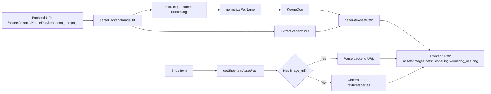
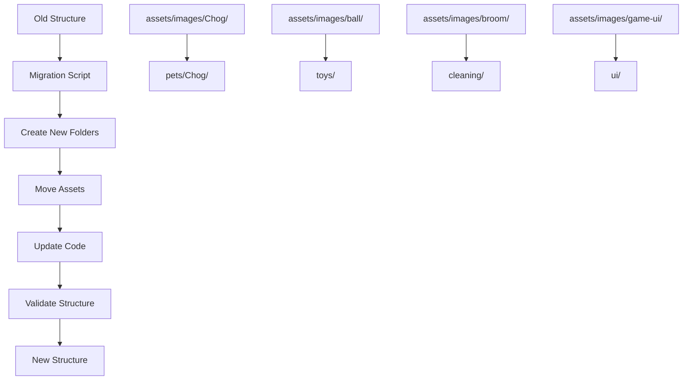

# Asset Structure Diagram

```mermaid
graph TD
    A[assets/images/] --> B[pets/]
    A --> C[food/]
    A --> D[toys/]
    A --> E[cleaning/]
    A --> F[backgrounds/]
    A --> G[effects/]
    A --> H[ui/]

    B --> I[Chog/]
    B --> J[KeoneDog/]
    B --> K[Ghost/]

    I --> L[chog_idle.png]
    I --> M[chog_idle.json]
    I --> N[chog_walk.png]
    I --> O[chog_walk.json]
    I --> P[chog_sleep.png]
    I --> Q[chog_sleep.json]
    I --> R[chog_chew.png]
    I --> S[chog_chew.json]
    I --> T[chog_idleplay.png]
    I --> U[chog_idleplay.json]

    J --> V[keonedog_idle.png]
    J --> W[keonedog_idle.json]
    J --> X[keonedog_walk.png]
    J --> Y[keonedog_walk.json]
    J --> Z[keonedog_sleep.png]
    J --> AA[keonedog_sleep.json]
    J --> BB[keonedog_chew.png]
    J --> CC[keonedog_chew.json]
    J --> DD[keonedog_idleplay.png]
    J --> EE[keonedog_idleplay.json]

    K --> FF[ghost_idle.png]
    K --> GG[ghost_idle.json]
    K --> HH[ghost_walk.png]
    K --> II[ghost_walk.json]
    K --> JJ[ghost_sleep.png]
    K --> KK[ghost_sleep.json]
    K --> LL[ghost_chew.png]
    K --> MM[ghost_chew.json]
    K --> NN[ghost_idleplay.png]
    K --> OO[ghost_idleplay.json]

    C --> PP[hamburger.png]
    D --> QQ[ball.png]
    E --> RR[broom.png]
    F --> SS[forest-bg.png]
    F --> TT[game-bg.png]
    F --> UU[sky.png]
    G --> VV[coin.png]
    G --> WW[heart.png]
    H --> XX[home.png]
    H --> YY[setting.png]
    H --> ZZ[shop.png]
```

## Backend URL Mapping Flow

```mermaid
flowchart LR
    A[Backend URL<br/>/assets/images/KeoneDog/keonedog_idle.png] --> B[parseBackendImageUrl]
    B --> C[Extract pet name: KeoneDog]
    B --> D[Extract variant: idle]
    C --> E[normalizePetName]
    E --> F[KeoneDog]
    F --> G[generateAssetPath]
    D --> G
    G --> H[Frontend Path<br/>assets/images/pets/KeoneDog/keonedog_idle.png]

    I[Shop Item] --> J[getShopItemAssetPath]
    J --> K{Has image_url?}
    K -->|Yes| L[Parse backend URL]
    K -->|No| M[Generate from texture/species]
    L --> H
    M --> H
```

## Migration Process

```mermaid
flowchart TD
    A[Old Structure] --> B[Migration Script]
    B --> C[Create New Folders]
    C --> D[Move Assets]
    D --> E[Update Code]
    E --> F[Validate Structure]
    F --> G[New Structure]

    A1[assets/images/Chog/] --> C1[pets/Chog/]
    A2[assets/images/ball/] --> C2[toys/]
    A3[assets/images/broom/] --> C3[cleaning/]
    A4[assets/images/game-ui/] --> C4[ui/]
```
